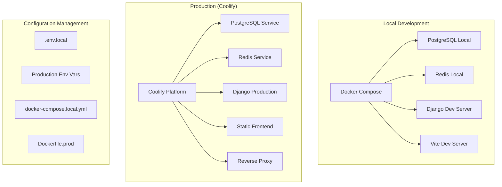
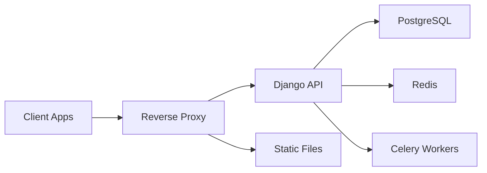

# Design Document

## Overview

This design outlines the architecture and implementation approach for making ZamIO production-ready with Coolify deployment. The solution maintains Docker Compose for local development while introducing production-optimized configurations, environment management, and deployment automation.

## Architecture

### Deployment Strategy



### Service Architecture

The production deployment will consist of:

1. **Backend Services**
   - Django API server (Gunicorn/Daphne)
   - Celery worker processes
   - Celery beat scheduler

2. **Frontend Applications**
   - Static builds served via nginx
   - zamio_frontend (Artist portal)
   - zamio_admin (Admin dashboard)
   - zamio_publisher (Publisher portal)
   - zamio_stations (Station portal)

3. **Infrastructure Services**
   - PostgreSQL database
   - Redis cache/message broker
   - File storage (local volumes or S3)

## Components and Interfaces

### 1. Production Dockerfiles

#### Backend Production Dockerfile
```dockerfile
# Multi-stage build for Django backend
FROM python:3.11-slim as base
# ... base dependencies

FROM base as production
# Production-specific configuration
# Gunicorn/Daphne setup
# Static file collection
```

#### Frontend Production Dockerfiles
```dockerfile
# Multi-stage build for React apps
FROM node:18-alpine as builder
# Build stage with npm run build

FROM nginx:alpine as production
# Serve static files with nginx
# Custom nginx configuration
```

### 2. Environment Configuration System

#### Configuration Hierarchy
1. **Base Configuration** - Common settings
2. **Environment Overrides** - Local vs Production
3. **Service-Specific** - Per-service customization
4. **Runtime Variables** - Dynamic configuration

#### Environment Variable Schema
```yaml
# Core Application
SECRET_KEY: string (required)
DEBUG: boolean (default: false)
ALLOWED_HOSTS: comma-separated string
BASE_URL: string (required)

# Database
DATABASE_URL: string (required)
DB_POOL_SIZE: integer (default: 10)

# Redis/Celery
REDIS_URL: string (required)
CELERY_WORKER_CONCURRENCY: integer (default: 4)

# Frontend API URLs
VITE_API_URL: string (required)
VITE_WS_URL: string (optional)

# Security
CORS_ALLOWED_ORIGINS: comma-separated string
CSRF_TRUSTED_ORIGINS: comma-separated string
```

### 3. Service Communication

#### Internal Service Discovery
- Use environment variables for service URLs
- Support both internal (service-to-service) and external (client-to-service) communication
- Implement service health checks and retry logic

#### API Gateway Pattern


### 4. Build and Deployment Pipeline

#### Build Process
1. **Source Code Preparation**
   - Environment-specific configuration injection
   - Dependency installation and optimization
   - Asset compilation and minification

2. **Image Creation**
   - Multi-stage Docker builds
   - Layer optimization for caching
   - Security scanning and validation

3. **Deployment Orchestration**
   - Service dependency management
   - Rolling updates with health checks
   - Configuration validation

## Data Models

### Configuration Models

#### Environment Configuration
```typescript
interface EnvironmentConfig {
  name: string;
  type: 'local' | 'staging' | 'production';
  services: ServiceConfig[];
  database: DatabaseConfig;
  redis: RedisConfig;
  security: SecurityConfig;
}

interface ServiceConfig {
  name: string;
  image: string;
  port: number;
  environment: Record<string, string>;
  healthCheck: HealthCheckConfig;
}
```

#### Deployment Configuration
```typescript
interface DeploymentConfig {
  version: string;
  services: DeploymentService[];
  networks: NetworkConfig[];
  volumes: VolumeConfig[];
}

interface DeploymentService {
  name: string;
  replicas: number;
  resources: ResourceLimits;
  updateStrategy: UpdateStrategy;
}
```

## Error Handling

### Configuration Validation
- **Missing Environment Variables**: Fail fast with clear error messages
- **Invalid Configuration**: Validate configuration schema on startup
- **Service Dependencies**: Implement retry logic with exponential backoff

### Runtime Error Handling
- **Database Connection Failures**: Connection pooling with automatic retry
- **Redis Connectivity Issues**: Graceful degradation for non-critical features
- **Service Communication**: Circuit breaker pattern for external dependencies

### Monitoring and Alerting
- **Health Check Endpoints**: `/health/` for basic status, `/health/detailed/` for comprehensive checks
- **Metrics Collection**: Prometheus-compatible metrics for key performance indicators
- **Log Aggregation**: Structured logging with correlation IDs for request tracing

## Testing Strategy

### Configuration Testing
1. **Environment Validation Tests**
   - Verify all required environment variables are present
   - Test configuration parsing and validation logic
   - Validate service connectivity with different configurations

2. **Build Process Tests**
   - Test Docker image builds for all services
   - Verify multi-stage build optimization
   - Test image security and vulnerability scanning

### Integration Testing
1. **Service Communication Tests**
   - Test API communication between services
   - Verify frontend-backend integration
   - Test WebSocket connections and real-time features

2. **Deployment Tests**
   - Test zero-downtime deployment scenarios
   - Verify rollback procedures
   - Test scaling operations

### Performance Testing
1. **Load Testing**
   - Test application performance under expected load
   - Verify database connection pooling efficiency
   - Test Celery task processing capacity

2. **Resource Usage Testing**
   - Monitor memory and CPU usage patterns
   - Test container resource limits
   - Verify caching effectiveness

## Implementation Phases

### Phase 1: Production Dockerfiles and Configuration
- Create production-optimized Dockerfiles for all services
- Implement environment variable management system
- Set up configuration validation and error handling

### Phase 2: Service Communication and Networking
- Implement dynamic service URL configuration
- Set up health checks and monitoring endpoints
- Configure reverse proxy and load balancing

### Phase 3: Security and Performance Optimization
- Implement production security measures
- Optimize static file serving and caching
- Set up logging and monitoring infrastructure

### Phase 4: Deployment Automation and Testing
- Create deployment scripts and documentation
- Implement automated testing for deployment scenarios
- Set up monitoring and alerting systems

## Security Considerations

### Production Security Measures
- Disable debug mode and development tools
- Implement proper CORS and CSRF protection
- Use secure headers and SSL/TLS configuration
- Validate and sanitize all user inputs

### Secrets Management
- Use environment variables for sensitive configuration
- Implement proper secret rotation procedures
- Ensure secrets are not logged or exposed in error messages

### Network Security
- Configure proper firewall rules and network segmentation
- Use internal service communication where possible
- Implement rate limiting and DDoS protection