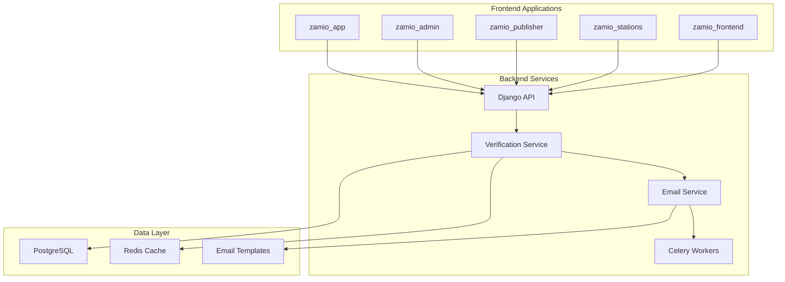
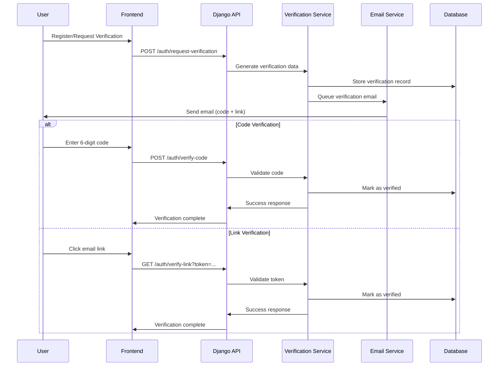

# Email Verification Enhancement Design Document

## Overview

This design document outlines the enhancement of ZamIO's email verification system to support both verification codes and verification links, providing users with flexible authentication options. The current system only supports link-based verification, which limits user choice and can create barriers for users with certain email clients or security preferences.

The enhanced system will maintain backward compatibility while introducing a dual-method verification approach that improves user experience, accessibility, and security across all ZamIO applications.

## Architecture

### High-Level Architecture



### Verification Flow Architecture



## Components and Interfaces

### 1. Enhanced User Model

The existing User model will be extended to support dual verification methods:

```python
class User(AbstractBaseUser):
    # Existing fields...
    
    # Enhanced verification fields
    email_verified = models.BooleanField(default=False)
    verification_method = models.CharField(
        max_length=10,
        choices=[('code', 'Code'), ('link', 'Link')],
        default='link'
    )
    verification_code = models.CharField(max_length=6, blank=True, null=True)
    verification_code_hash = models.CharField(max_length=64, blank=True, null=True)
    verification_token = models.CharField(max_length=64, blank=True, null=True)  # Renamed from email_token
    verification_expires_at = models.DateTimeField(blank=True, null=True)
    verification_attempts = models.IntegerField(default=0)
    verification_blocked_until = models.DateTimeField(blank=True, null=True)
    last_verification_request = models.DateTimeField(blank=True, null=True)
```

### 2. Verification Service

A dedicated service class to handle all verification logic:

```python
class EmailVerificationService:
    """
    Centralized service for managing email verification with dual methods
    """
    
    def __init__(self):
        self.code_length = 6
        self.code_expiry_minutes = 15
        self.token_expiry_minutes = 60
        self.max_attempts = 5
        self.rate_limit_minutes = 15
        self.block_duration_minutes = 30
        self.resend_cooldown_minutes = 2  # Minimum time between resends
        self.max_resends_per_hour = 3
    
    def generate_verification_code(self) -> str:
        """Generate secure 6-digit verification code"""
        pass
    
    def generate_verification_token(self) -> str:
        """Generate secure verification token for links"""
        pass
    
    def create_verification_request(self, user: User, method: str) -> dict:
        """Create new verification request with selected method"""
        pass
    
    def resend_verification(self, user: User, method: str = None) -> dict:
        """Resend verification with rate limiting and cooldown"""
        pass
    
    def verify_code(self, user: User, code: str) -> dict:
        """Verify user-provided code"""
        pass
    
    def verify_token(self, user: User, token: str) -> dict:
        """Verify token from email link"""
        pass
    
    def is_rate_limited(self, user: User) -> bool:
        """Check if user is rate limited"""
        pass
    
    def can_resend(self, user: User) -> dict:
        """Check if user can resend verification with cooldown info"""
        pass
    
    def cleanup_expired_verifications(self):
        """Clean up expired verification data"""
        pass


class PasswordResetService:
    """
    Centralized service for managing password reset with dual methods
    """
    
    def __init__(self):
        self.code_length = 6
        self.code_expiry_minutes = 15
        self.token_expiry_minutes = 60
        self.max_attempts = 5
        self.rate_limit_minutes = 15
        self.resend_cooldown_minutes = 2
        self.max_resends_per_hour = 3
    
    def create_reset_request(self, user: User, method: str) -> dict:
        """Create new password reset request"""
        pass
    
    def resend_reset(self, user: User, method: str = None) -> dict:
        """Resend password reset with rate limiting"""
        pass
    
    def verify_reset_code(self, user: User, code: str, new_password: str) -> dict:
        """Verify reset code and update password"""
        pass
    
    def verify_reset_token(self, user: User, token: str, new_password: str) -> dict:
        """Verify reset token and update password"""
        pass
    
    def can_resend_reset(self, user: User) -> dict:
        """Check if user can resend password reset"""
        pass
    
    def cleanup_expired_resets(self):
        """Clean up expired reset data"""
        pass
```

### 3. Enhanced API Endpoints

#### Verification Request Endpoint
```python
@api_view(['POST'])
def request_email_verification(request):
    """
    Request email verification with method selection
    
    Body:
    {
        "method": "code|link",  # Optional, defaults to user preference or 'link'
        "email": "user@example.com"  # Optional for authenticated users
    }
    """
```

#### Resend Verification Endpoint
```python
@api_view(['POST'])
def resend_email_verification(request):
    """
    Resend email verification with same or different method
    
    Body:
    {
        "method": "code|link",  # Optional, maintains current method if not specified
        "email": "user@example.com"  # Optional for authenticated users
    }
    
    Response includes:
    - Rate limiting information
    - Time until next resend allowed
    - Method used for resend
    """
```

#### Code Verification Endpoint
```python
@api_view(['POST'])
def verify_email_code(request):
    """
    Verify email using 6-digit code
    
    Body:
    {
        "code": "123456",
        "email": "user@example.com"  # Optional for authenticated users
    }
    """
```

#### Link Verification Endpoint
```python
@api_view(['GET', 'POST'])
def verify_email_link(request):
    """
    Verify email using token from link
    
    Query params (GET) or Body (POST):
    {
        "token": "verification_token",
        "email": "user@example.com"
    }
    """
```

#### Method Switch Endpoint
```python
@api_view(['POST'])
def switch_verification_method(request):
    """
    Switch between verification methods
    
    Body:
    {
        "method": "code|link"
    }
    """
```

#### Password Reset Request Endpoint
```python
@api_view(['POST'])
def request_password_reset(request):
    """
    Request password reset with dual method support
    
    Body:
    {
        "email": "user@example.com",
        "method": "code|link"  # Optional, defaults to 'link'
    }
    """
```

#### Resend Password Reset Endpoint
```python
@api_view(['POST'])
def resend_password_reset(request):
    """
    Resend password reset with method selection
    
    Body:
    {
        "email": "user@example.com",
        "method": "code|link"  # Optional, maintains current method if not specified
    }
    
    Response includes:
    - Rate limiting information
    - Time until next resend allowed
    - Method used for resend
    """
```

#### Password Reset Verification Endpoints
```python
@api_view(['POST'])
def verify_password_reset_code(request):
    """
    Verify password reset using 6-digit code
    
    Body:
    {
        "email": "user@example.com",
        "code": "123456",
        "new_password": "new_secure_password"
    }
    """

@api_view(['POST'])
def verify_password_reset_token(request):
    """
    Verify password reset using token from link
    
    Body:
    {
        "token": "reset_token",
        "email": "user@example.com",
        "new_password": "new_secure_password"
    }
    """
```

### 4. Frontend Components

#### Verification Method Selection Component
```typescript
interface VerificationMethodSelectorProps {
  onMethodSelect: (method: 'code' | 'link') => void;
  defaultMethod?: 'code' | 'link';
  disabled?: boolean;
}

export const VerificationMethodSelector: React.FC<VerificationMethodSelectorProps> = ({
  onMethodSelect,
  defaultMethod = 'link',
  disabled = false
}) => {
  // Component implementation
};
```

#### Code Input Component
```typescript
interface CodeInputProps {
  onCodeComplete: (code: string) => void;
  onCodeChange?: (code: string) => void;
  error?: string;
  loading?: boolean;
  autoFocus?: boolean;
}

export const CodeInput: React.FC<CodeInputProps> = ({
  onCodeComplete,
  onCodeChange,
  error,
  loading = false,
  autoFocus = true
}) => {
  // 6-digit code input implementation with accessibility
};
```

#### Verification Status Component
```typescript
interface VerificationStatusProps {
  status: 'pending' | 'verifying' | 'success' | 'error';
  method: 'code' | 'link';
  expiresAt?: Date;
  onResend?: () => void;
  onSwitchMethod?: (method: 'code' | 'link') => void;
  error?: string;
  canResend?: boolean;
  resendCooldownSeconds?: number;
  resendCount?: number;
  maxResends?: number;
}

export const VerificationStatus: React.FC<VerificationStatusProps> = (props) => {
  // Status display with countdown timer, resend cooldown, and action buttons
};
```

#### Resend Control Component
```typescript
interface ResendControlProps {
  onResend: () => void;
  canResend: boolean;
  cooldownSeconds?: number;
  resendCount: number;
  maxResends: number;
  loading?: boolean;
  disabled?: boolean;
}

export const ResendControl: React.FC<ResendControlProps> = ({
  onResend,
  canResend,
  cooldownSeconds = 0,
  resendCount,
  maxResends,
  loading = false,
  disabled = false
}) => {
  // Resend button with cooldown timer and attempt tracking
};
```

#### Password Reset Flow Component
```typescript
interface PasswordResetFlowProps {
  onMethodSelect: (method: 'code' | 'link') => void;
  onCodeSubmit: (code: string) => void;
  onResend: () => void;
  method?: 'code' | 'link';
  status: 'idle' | 'sending' | 'sent' | 'verifying' | 'success' | 'error';
  error?: string;
  canResend?: boolean;
  resendCooldownSeconds?: number;
}

export const PasswordResetFlow: React.FC<PasswordResetFlowProps> = (props) => {
  // Complete password reset flow with method selection and resend functionality
};
```

### 5. Email Template Enhancement

#### Enhanced Email Templates

##### Email Verification Template
```html
<!-- Enhanced email template supporting both methods -->
<div class="verification-email">
  <h1>Verify Your ZamIO Account</h1>
  
  <div class="verification-methods">
    <div class="method-option">
      <h2>Option 1: Verification Code</h2>
      <div class="verification-code">{{ verification_code }}</div>
      <p>Enter this 6-digit code in the application</p>
      <p>Code expires in 15 minutes</p>
    </div>
    
    <div class="method-divider">OR</div>
    
    <div class="method-option">
      <h2>Option 2: Verification Link</h2>
      <a href="{{ verification_url }}" class="verify-button">
        Verify Email Address
      </a>
      <p>Click the button above to verify instantly</p>
      <p>Link expires in 1 hour</p>
    </div>
  </div>
  
  <div class="resend-info">
    
    <p><em>This is resend #{{ resend_count }}. You can resend up to 3 times per hour.</em></p>
    
  </div>
  
  <div class="security-notice">
    <p>If you didn't request this verification, please ignore this email.</p>
  </div>
</div>
```

##### Password Reset Template
```html
<!-- Enhanced password reset template supporting both methods -->
<div class="password-reset-email">
  <h1>Reset Your ZamIO Password</h1>
  
  <div class="reset-methods">
    <div class="method-option">
      <h2>Option 1: Reset Code</h2>
      <div class="reset-code">{{ reset_code }}</div>
      <p>Enter this 6-digit code along with your new password</p>
      <p>Code expires in 15 minutes</p>
    </div>
    
    <div class="method-divider">OR</div>
    
    <div class="method-option">
      <h2>Option 2: Reset Link</h2>
      <a href="{{ reset_url }}" class="reset-button">
        Reset Password
      </a>
      <p>Click the button above to reset your password</p>
      <p>Link expires in 1 hour</p>
    </div>
  </div>
  
  <div class="resend-info">
    
    <p><em>This is resend #{{ resend_count }}. You can resend up to 3 times per hour.</em></p>
    
  </div>
  
  <div class="security-notice">
    <p>If you didn't request this password reset, please ignore this email and consider changing your password.</p>
    <p>Request made from IP: {{ request_ip }} at {{ request_time }}</p>
  </div>
</div>
```

## Data Models

### Enhanced Verification Model
```python
class EmailVerification(models.Model):
    """
    Dedicated model for tracking email verification attempts and history
    """
    user = models.ForeignKey(User, on_delete=models.CASCADE, related_name='email_verifications')
    method = models.CharField(max_length=10, choices=[('code', 'Code'), ('link', 'Link')])
    code_hash = models.CharField(max_length=64, blank=True, null=True)  # Hashed verification code
    token = models.CharField(max_length=64, blank=True, null=True)  # Verification token
    created_at = models.DateTimeField(auto_now_add=True)
    expires_at = models.DateTimeField()
    verified_at = models.DateTimeField(blank=True, null=True)
    attempts = models.IntegerField(default=0)
    resend_count = models.IntegerField(default=0)
    last_resend_at = models.DateTimeField(blank=True, null=True)
    ip_address = models.GenericIPAddressField(blank=True, null=True)
    user_agent = models.TextField(blank=True, null=True)
    is_active = models.BooleanField(default=True)
    
    class Meta:
        indexes = [
            models.Index(fields=['user', 'is_active']),
            models.Index(fields=['token']),
            models.Index(fields=['expires_at']),
            models.Index(fields=['last_resend_at']),
        ]
    
    def is_expired(self) -> bool:
        return timezone.now() > self.expires_at
    
    def can_attempt(self) -> bool:
        return self.is_active and not self.is_expired() and self.attempts < 5
    
    def can_resend(self, cooldown_minutes: int = 2) -> bool:
        if not self.last_resend_at:
            return True
        cooldown_period = timedelta(minutes=cooldown_minutes)
        return timezone.now() > (self.last_resend_at + cooldown_period)


class PasswordReset(models.Model):
    """
    Dedicated model for tracking password reset attempts and history
    """
    user = models.ForeignKey(User, on_delete=models.CASCADE, related_name='password_resets')
    method = models.CharField(max_length=10, choices=[('code', 'Code'), ('link', 'Link')])
    code_hash = models.CharField(max_length=64, blank=True, null=True)  # Hashed reset code
    token = models.CharField(max_length=64, blank=True, null=True)  # Reset token
    created_at = models.DateTimeField(auto_now_add=True)
    expires_at = models.DateTimeField()
    used_at = models.DateTimeField(blank=True, null=True)
    attempts = models.IntegerField(default=0)
    resend_count = models.IntegerField(default=0)
    last_resend_at = models.DateTimeField(blank=True, null=True)
    ip_address = models.GenericIPAddressField(blank=True, null=True)
    user_agent = models.TextField(blank=True, null=True)
    is_active = models.BooleanField(default=True)
    
    class Meta:
        indexes = [
            models.Index(fields=['user', 'is_active']),
            models.Index(fields=['token']),
            models.Index(fields=['expires_at']),
            models.Index(fields=['last_resend_at']),
        ]
    
    def is_expired(self) -> bool:
        return timezone.now() > self.expires_at
    
    def can_attempt(self) -> bool:
        return self.is_active and not self.is_expired() and self.attempts < 5 and not self.used_at
    
    def can_resend(self, cooldown_minutes: int = 2) -> bool:
        if not self.last_resend_at:
            return True
        cooldown_period = timedelta(minutes=cooldown_minutes)
        return timezone.now() > (self.last_resend_at + cooldown_period)
```

### Rate Limiting Model
```python
class VerificationRateLimit(models.Model):
    """
    Track rate limiting for verification requests
    """
    user = models.ForeignKey(User, on_delete=models.CASCADE)
    ip_address = models.GenericIPAddressField()
    request_count = models.IntegerField(default=1)
    window_start = models.DateTimeField(auto_now_add=True)
    blocked_until = models.DateTimeField(blank=True, null=True)
    
    class Meta:
        unique_together = ('user', 'ip_address')
        indexes = [
            models.Index(fields=['user', 'window_start']),
            models.Index(fields=['ip_address', 'window_start']),
        ]
```

## Error Handling

### Comprehensive Error Response System
```python
class VerificationErrorCodes:
    INVALID_CODE = 'INVALID_CODE'
    EXPIRED_CODE = 'EXPIRED_CODE'
    INVALID_TOKEN = 'INVALID_TOKEN'
    EXPIRED_TOKEN = 'EXPIRED_TOKEN'
    RATE_LIMITED = 'RATE_LIMITED'
    ALREADY_VERIFIED = 'ALREADY_VERIFIED'
    MAX_ATTEMPTS_EXCEEDED = 'MAX_ATTEMPTS_EXCEEDED'
    INVALID_METHOD = 'INVALID_METHOD'
    USER_BLOCKED = 'USER_BLOCKED'

class VerificationError(Exception):
    def __init__(self, code: str, message: str, retry_after: int = None):
        self.code = code
        self.message = message
        self.retry_after = retry_after
        super().__init__(message)

# Error response format
{
    "error": {
        "code": "RATE_LIMITED",
        "message": "Too many verification attempts. Please try again later.",
        "retry_after": 1800,  # seconds
        "details": {
            "attempts_remaining": 0,
            "reset_time": "2024-01-01T12:00:00Z"
        }
    }
}
```

### Frontend Error Handling
```typescript
interface VerificationError {
  code: string;
  message: string;
  retryAfter?: number;
  details?: Record<string, any>;
}

class VerificationErrorHandler {
  static handle(error: VerificationError): {
    userMessage: string;
    action?: 'retry' | 'resend' | 'wait' | 'contact_support';
    retryAfter?: number;
  } {
    switch (error.code) {
      case 'INVALID_CODE':
        return {
          userMessage: 'Invalid verification code. Please check and try again.',
          action: 'retry'
        };
      case 'RATE_LIMITED':
        return {
          userMessage: 'Too many attempts. Please wait before trying again.',
          action: 'wait',
          retryAfter: error.retryAfter
        };
      // ... other error cases
    }
  }
}
```

## Testing Strategy

### Backend Testing
```python
class EmailVerificationTestCase(TestCase):
    def test_code_generation_uniqueness(self):
        """Test that verification codes are unique and secure"""
        pass
    
    def test_code_verification_success(self):
        """Test successful code verification"""
        pass
    
    def test_code_verification_failure(self):
        """Test failed code verification scenarios"""
        pass
    
    def test_token_verification_success(self):
        """Test successful token verification"""
        pass
    
    def test_rate_limiting(self):
        """Test rate limiting functionality"""
        pass
    
    def test_method_switching(self):
        """Test switching between verification methods"""
        pass
    
    def test_expiration_handling(self):
        """Test proper handling of expired codes and tokens"""
        pass
    
    def test_security_measures(self):
        """Test security measures like code hashing"""
        pass
```

### Frontend Testing
```typescript
describe('CodeInput Component', () => {
  it('should handle 6-digit code input correctly', () => {
    // Test code input functionality
  });
  
  it('should be fully keyboard accessible', () => {
    // Test keyboard navigation
  });
  
  it('should announce changes to screen readers', () => {
    // Test accessibility
  });
});

describe('VerificationFlow', () => {
  it('should support method switching', () => {
    // Test method switching functionality
  });
  
  it('should handle rate limiting gracefully', () => {
    // Test rate limiting UI
  });
  
  it('should show appropriate error messages', () => {
    // Test error handling
  });
});
```

### Integration Testing
```python
class VerificationIntegrationTest(TestCase):
    def test_end_to_end_code_verification(self):
        """Test complete code verification flow"""
        pass
    
    def test_end_to_end_link_verification(self):
        """Test complete link verification flow"""
        pass
    
    def test_cross_platform_consistency(self):
        """Test verification works consistently across all frontends"""
        pass
    
    def test_email_delivery_and_templates(self):
        """Test email generation and delivery"""
        pass
```

## Security Considerations

### Code Security
- **Cryptographically Secure Generation**: Use `secrets.SystemRandom()` for code generation
- **Hash Storage**: Store hashed codes using bcrypt, never plain text
- **Timing Attack Prevention**: Use constant-time comparison for code validation
- **Rate Limiting**: Implement progressive delays and temporary blocks

### Token Security
- **Secure Token Generation**: Use 32-byte random tokens encoded as base64
- **Single Use**: Invalidate tokens immediately after successful verification
- **Scope Limitation**: Tokens only valid for email verification, not general authentication

### General Security
- **IP-based Rate Limiting**: Track attempts by both user and IP address
- **Audit Logging**: Log all verification attempts with metadata
- **Cleanup Jobs**: Regular cleanup of expired verification data
- **CSRF Protection**: Ensure all state-changing endpoints are CSRF protected

## Performance Considerations

### Database Optimization
- **Indexing Strategy**: Proper indexes on frequently queried fields
- **Cleanup Jobs**: Regular cleanup of expired verification records
- **Connection Pooling**: Efficient database connection management

### Caching Strategy
```python
# Redis caching for rate limiting and temporary data
VERIFICATION_CACHE_KEYS = {
    'rate_limit': 'verification:rate_limit:{user_id}:{ip}',
    'attempts': 'verification:attempts:{user_id}',
    'block': 'verification:block:{user_id}',
}

# Cache verification attempts for quick rate limit checks
cache.setex(
    VERIFICATION_CACHE_KEYS['attempts'].format(user_id=user.id),
    900,  # 15 minutes
    attempts_count
)
```

### Email Performance
- **Async Processing**: All email sending through Celery background tasks
- **Template Caching**: Cache compiled email templates
- **Delivery Optimization**: Use email service providers with good deliverability

## Implementation Phases

### Phase 1: Backend Foundation (Week 1-2)
1. Database model enhancements and migrations
2. Core verification service implementation
3. Enhanced API endpoints
4. Security and rate limiting implementation

### Phase 2: Email System Enhancement (Week 2-3)
1. Enhanced email templates with dual methods
2. Updated Celery tasks for new verification flow
3. Email delivery optimization and monitoring
4. Template testing and validation

### Phase 3: Frontend Implementation (Week 3-4)
1. Shared verification components development
2. Code input component with accessibility
3. Method selection and switching interfaces
4. Error handling and user feedback systems

### Phase 4: Cross-Platform Integration (Week 4-5)
1. Integration with zamio_frontend
2. Integration with zamio_admin, zamio_stations, zamio_publisher
3. Mobile app integration and optimization
4. Consistent styling and theming

### Phase 5: Testing and Optimization (Week 5-6)
1. Comprehensive testing suite implementation
2. Performance optimization and monitoring
3. Security audit and penetration testing
4. User acceptance testing and feedback integration

### Phase 6: Deployment and Monitoring (Week 6)
1. Production deployment with feature flags
2. Monitoring and alerting setup
3. Documentation and training materials
4. Gradual rollout and user migration

**Design Rationale**: The phased approach ensures that core functionality is solid before building user interfaces, and allows for iterative testing and refinement. The dual-method approach provides maximum flexibility while maintaining security and usability standards.