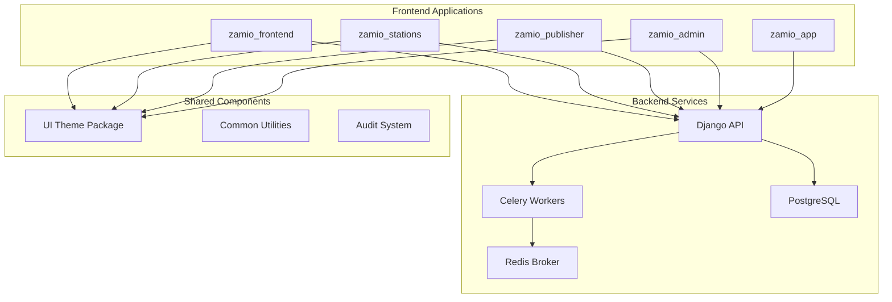

# Platform Improvements Design Document

## Overview

This design document outlines comprehensive improvements to the ZamIO platform addressing critical issues across backend task management, user experience, UI consistency, performance optimization, and system reliability. The improvements span all frontend applications (zamio_frontend, zamio_stations, zamio_publisher, zamio_admin), backend services, and deployment infrastructure.

The design follows a systematic approach to resolve existing issues while establishing robust patterns for future development. Key focus areas include proper async task management with Celery, consistent UI/UX across all applications, real data integration replacing demo content, and enhanced system reliability.

## Architecture

### High-Level Architecture Changes



### Task Management Architecture

The platform will implement a robust background task system using Celery with Redis as the message broker. This addresses the critical need for reliable async processing of emails, notifications, and other background operations.

**Design Decision**: Celery was chosen over Django's built-in async capabilities because it provides better scalability, monitoring, and failure recovery for the platform's complex background processing needs.

### Data Flow Architecture

All frontend applications will transition from demo data to real backend integration, establishing consistent API patterns and data management across the platform.

## Components and Interfaces

### 1. Background Task Management System

#### Celery Task Registry
- **Purpose**: Centralized task registration to prevent KeyError exceptions
- **Implementation**: Auto-discovery mechanism for all task modules
- **Location**: `zamio_backend/core/celery.py`

```python
# Task registration pattern
from celery import Celery
from django.conf import settings

app = Celery('zamio')
app.config_from_object('django.conf:settings', namespace='CELERY')
app.autodiscover_tasks()

# Explicit task imports to ensure registration
from music_monitor.tasks import run_matchcache_to_playlog
from notifications.tasks import send_email_verification
from accounts.tasks import send_password_reset
```

#### Task Categories
1. **Email Tasks**: Verification, password reset, notifications
2. **Audio Processing**: Fingerprinting, stream monitoring
3. **Royalty Processing**: Calculations, distributions
4. **System Maintenance**: Cleanup, health checks

### 2. Authentication and Session Management

#### Unified Logout System
- **Purpose**: Consistent logout behavior across all applications
- **Implementation**: Standardized logout API endpoint with proper session cleanup
- **Audit Integration**: All logout events logged for security monitoring

```typescript
// Shared logout utility
export const logoutUser = async () => {
  try {
    await api.post('/auth/logout/');
    // Clear local storage
    localStorage.removeItem('token');
    // Clear session storage
    sessionStorage.clear();
    // Redirect to login
    window.location.href = '/sign-in';
  } catch (error) {
    console.error('Logout failed:', error);
  }
};
```

### 3. File Upload and Storage System

#### Secure File Handling
- **Purpose**: Reliable KYC document and media file uploads
- **Implementation**: Django file fields with proper validation and storage
- **Security**: File type validation, size limits, secure path generation

```python
# File upload model pattern
class DocumentUpload(models.Model):
    user = models.ForeignKey(User, on_delete=models.CASCADE)
    file = models.FileField(upload_to='documents/%Y/%m/%d/')
    file_tyrField(max_length=5ploaded_at = models.DateTimeField(auerified = models.BooleanField(default=False)
```

### 4. UI Consistency Framework

#### Shared Theme System
- **Purpose**: Consistent design language across all applications
- **Implementation**: Enhanced ui-theme package with comprehensive component library
- **Dark/Light Mode**: Unified theme switching with persistence

```typescript
// Theme context pattern
interface ThemeContextType {
  theme: 'light' | 'dark';
  toggleTheme: () => void;
  colors: ThemeColors;
  spacing: ThemeSpacing;
}

export const ThemeProvider: React.FC<{ children: React.ReactNode }> = ({ children }) => {
  const [theme, setTheme] = useState<'light' | 'dark'>('light');
  
  const toggleTheme = () => {
    const newTheme = theme === 'light' ? 'dark' : 'light';
    setTheme(newTheme);
    localStorage.setItem('theme', newTheme);
  };
  
  return (
    <ThemeContext.Provider value={{ theme, toggleTheme, colors, spacing }}>
      {children}
    </ThemeContext.Provider>
  );
};
```

### 5. Input Validation System

#### Frontend Validation Framework
- **Purpose**: Consistent form validation across all applications
- **Implementation**: Shared validation utilities with real-time feedback
- **Integration**: Backend validation mirroring for security

```typescript
// Validation utility pattern
export const validators = {
  email: (value: string) => /^[^\s@]+@[^\s@]+\.[^\s@]+$/.test(value),
  numeric: (value: string) => /^\d+(\.\d+)?$/.test(value),
  required: (value: any) => value !== null && value !== undefined && value !== '',
};

export const useFormValidation = (schema: ValidationSchema) => {
  const [errors, setErrors] = useState<Record<string, string>>({});
  
  const validate = (field: string, value: any) => {
    const fieldSchema = schema[field];
    if (!fieldSchema) return true;
    
    for (const rule of fieldSchema.rules) {
      if (!rule.validator(value)) {
        setErrors(prev => ({ ...prev, [field]: rule.message }));
        return false;
      }
    }
    
    setErrors(prev => ({ ...prev, [field]: '' }));
    return true;
  };
  
  return { errors, validate };
};
```

### 6. Performance Optimization Framework

#### Code Splitting Strategy
- **Purpose**: Faster initial page loads and better user experience
- **Implementation**: Route-based code splitting with lazy loading
- **Caching**: Intelligent API response caching

```typescript
// Lazy loading pattern
const Dashboard = lazy(() => import('./pages/Dashboard'));
const Profile = lazy(() => import('./pages/Profile'));
const Settings = lazy(() => import('./pages/Settings'));

// Route configuration with suspense
<Routes>
  <Route path="/dashboard" element={
    <Suspense fallback={<LoadingSpinner />}>
      <Dashboard />
    </Suspense>
  } />
</Routes>
```

### 7. Real Data Integration System

#### API Integration Framework
- **Purpose**: Replace all demo data with real backend integration
- **Implementation**: Consistent API service layer across applications
- **Error Handling**: Unified error handling and loading states

```typescript
// API service pattern
class ApiService {
  private baseURL: string;
  
  constructor() {
    this.baseURL = import.meta.env.VITE_API_URL;
  }
  
  async get<T>(endpoint: string): Promise<T> {
    const response = await fetch(`${this.baseURL}${endpoint}`, {
      headers: this.getHeaders(),
    });
    
    if (!response.ok) {
      throw new ApiError(response.status, await response.text());
    }
    
    return response.json();
  }
  
  private getHeaders() {
    return {
      'Content-Type': 'application/json',
      'Authorization': `Token ${localStorage.getItem('token')}`,
    };
  }
}
```

## Data Models

### Enhanced User Model
```python
class User(AbstractUser):
    # Existing fields...
    location = models.CharField(max_length=255, blank=True, null=True)
    theme_preference = models.CharField(
        max_length=10, 
        choices=[('light', 'Light'), ('dark', 'Dark')], 
        default='light'
    )
    verification_status = models.CharField(
        max_length=20,
        choices=[
            ('pending', 'Pending'),
            ('verified', 'Verified'),
            ('skipped', 'Skipped'),
        ],
        default='pending'
    )
```

### Audit Log Model
```python
class AuditLog(models.Model):
    user = models.ForeignKey(User, on_delete=models.SET_NULL, null=True)
    action = models.CharField(max_length=100)
    resource_type = models.CharField(max_length=50)
    resource_id = models.CharField(max_length=100, null=True)
    details = models.JSeld(default=dict)
    ip_address = m.GenericIPAddressull=True)ser_agenels.TextField(null=True)
    timestamp = models.DateTimeField(auto_now_add=True)
```

### Station Stream Model Enhancement
```python
class Station(models.Model):
    # Existing fields...
    stream_url = models.URLField(blank=True, null=True)
    stream_status = models.CharField(
        max_length=20,
        choices=[
            ('active', 'Active'),
            ('inactive', 'Inactive'),
            ('error', 'Error'),
        ],
        default='inactive'
    )
    last_monitored = models.DateTimeField(null=True, blank=True)
```

### Complaint System Model
```python
class Complaint(models.Model):
    station = models.ForeignKey(Station, on_delete=models.CASCADE)
    complainant = models.ForeignKey(User, on_delete=models.CASCADE)
    subject = models.CharField(max_length=200)
    description = models.TextField()
    status = models.CharField(
        max_length=20,
        choices=[
            ('open', 'Open'),
            ('investigating', 'Investigating'),
            ('resolved', 'Resolved'),
            ('closed', 'Closed'),
        ],
        default='open'
    )
    created_at = models.DateTimeField(auto_now_add=True)
    updated_at = models.DateTimeField(auto_now=True)
```

### Royalty Management Enhancement
```python
class RoyaltyWithdrawal(models.Model):
    user = models.ForeignKey(User, on_delete=models.CASCADE)
    amount = models.DecimalField(max_digits=10, decimal_places=2)
    status = models.CharField(
        max_length=20,
        choices=[
            ('pending', 'Pending'),
            ('approved', 'Approved'),
            ('rejected', 'Rejected'),
            ('processed', 'Processed'),
        ],
        default='pending'
    )
    publishing_status_check = models.BooleanField(default=True)
    requested_at = models.DateTimeField(auto_now_add=True)
```

## Error Handling

### Centralized Error Management
- **Frontend**: Unified error boundary components with user-friendly messages
- **Backend**: Structured error responses with proper HTTP status codes
- **Logging**: Comprehensive error logging with context informatiion
```typescript
// pattern
class ErrorBoundary extendsnent<Props, State> {
  constructor(props: Props) {
    super(props);
    this.state = { hasError: false, error: null };
  }
  
  static getDerivedStateFromError(error: Error): State {
    return { hasError: true, error };
  }
  
  componentDidCatch(error: Error, errorInfo: React.ErrorInfo) {
    console.error('Error caught by boundary:', error, errorInfo);
    // Send to error reporting service
  }
  
  render() {
    if (this.state.hasError) {
      return <ErrorFallback error={this.state.error} />;
    }
    
    return this.props.children;
  }
}
```

### API Error Handling
```python
# Django error handling
class APIErrorHandler:
    @staticmethod
    def handle_validation_error(error):
        return Response({
            'error': 'validation_failed',
            'details': error.detail,
            'timestamp': timezone.now().isoformat()
        }, status=400)
    
    @staticmethod
    def handle_permission_error(error):
        return Response({
            'error': 'permission_denied',
            'message': 'You do not have permission to perform this action',
            'timestamp': timezone.now().isoformat()
        }, status=403)
```

## Testing Strategy

### Frontend Testing
- **Unit Tests**: Component testing with Vitest and React Testing Library
- **Integration Tests**: API integration testing with mock services
- **E2E Tests**: Playwright tests for critical user workflows
- **Accessibility Tests**: Jest-axe integration for WCAG compliance

### Backend Testing
- **Unit Tests**: Django test framework for models and utilities
- **API Tests**: DRF test client for endpoint testing
- **Task Tests**: Celery task testing with test broker
- **Performance Tests**: Load testing for critical endpoints

### Cross-Platform Testing
- **Theme Testing**: Automated testing of dark/light mode across applications
- **Responsive Testing**: Multi-device testing for all frontends
- **Integration Testing**: End-to-end workflow testing across applications

## Implementation Phases

### Phase 1: Foundation (Backend Infrastructure)
1. Celery task system implementation and registration fix
2. Audit logging system implementation
3. Enhanced authentication and session management
4. File upload system improvements

### Phase 2: Frontend Consistency
1. UI theme package enhancement
2. Shared validation framework
3. Consistent logout implementation
4. Icon standardization across applications

### Phase 3: Data Integration
1. Replace demo data with real API integration
2. Implement missing backend endpoints
3. Admin dashboard real data integration
4. Publisher dashboard integration

### Phase 4: Feature Completion
1. Location-based onboarding implementation
2. Station stream URL management
3. Complaint system completion
4. Royalty management by publishing status

### Phase 5: Performance and Polish
1. Code splitting and lazy loading implementation
2. Performance optimization
3. Accessibility improvements
4. Comprehensive testing coverage

**Design Rationale**: The phased approach ensures that foundational issues are resolved first, providing a stable base for feature development. Each phase builds upon the previous one, minimizing integration risks and allowing for iterative testing and validation.