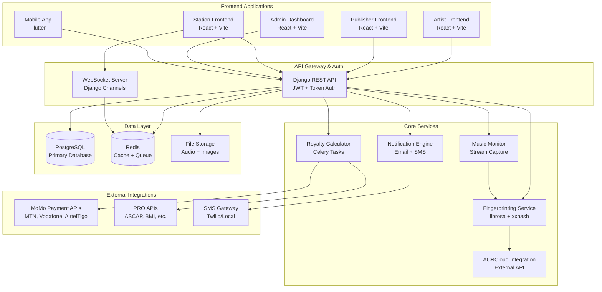

# Design Document

## Overview

This design document outlines the comprehensive improvements to the ZamIO royalty management platform to create a professional-grade system capable of partnering with major PROs like ASCAP, BMI, and international organizations. The design focuses on UI/UX consistency, robust role-based functionality, industry-standard audio detection, and complete royalty management workflows.

The platform will serve as Ghana's premier music royalty management system, handling everything from local artist self-publishing to complex international PRO relationships and reciprocal agreements.

## Architecture

### System Architecture Overview



### Technology Stack Enhancements

**Backend Improvements:**
- Enhanced Django REST Framework with comprehensive serializers
- JWT authentication with refresh tokens for better security
- Celery with Redis for background task processing
- Django Channels for real-time WebSocket communication
- Comprehensive logging and monitoring with structured logs

**Frontend Standardization:**
- Consistent React 18 + TypeScript + Vite setup across all applications
- Unified design system with TailwindCSS and custom component library
- Centralized API client with automatic token refresh and error handling
- React Query for efficient data fetching and caching
- Progressive Web App (PWA) capabilities for offline functionality

**Mobile Enhancement:**
- Flutter app with offline-first architecture
- Background audio capture with efficient battery management
- Automatic sync when connectivity is restored
- Push notifications for important updates

## Components and Interfaces

### 1. Enhanced Authentication System

**JWT Token Management:**
```typescript
interface AuthTokens {
  access: string;
  refresh: string;
  expires_at: number;
}

interface UserSession {
  user_id: string;
  user_type: 'Artist' | 'Station' | 'Admin' | 'Publisher';
  permissions: string[];
  profile_complete: boolean;
  kyc_status: 'pending' | 'verified' | 'rejected';
}
```

**Role-Based Access Control:**
- Granular permissions system with endpoint-level controls
- Dynamic permission checking based on user type and status
- Automatic role assignment for self-published artists
- Publisher-artist relationship management with proper access controls

### 2. Unified Design System

**Theme Management:**
```typescript
interface ThemeConfig {
  mode: 'light' | 'dark';
  colors: {
    primary: string;
    secondary: string;
    background: string;
    surface: string;
    text: string;
    error: string;
    warning: string;
    success: string;
  };
  typography: {
    fontFamily: string;
    sizes: Record<string, string>;
  };
}
```

**Component Library:**
- Standardized UI components with theme support
- Consistent iconography using Heroicons/Lucide React
- Responsive design patterns for all screen sizes
- Accessibility-compliant components with ARIA labels

### 3. Enhanced Audio Detection Pipeline

**Hybrid Fingerprinting System:**
```python
class HybridFingerprintMatcher:
    def __init__(self):
        self.local_matcher = LocalFingerprintMatcher()
        self.acrcloud_client = ACRCloudClient()
        self.pro_mapper = PROMapper()
    
    async def identify_audio(self, audio_segment: bytes) -> MatchResult:
        # Try local fingerprinting first
        local_match = await self.local_matcher.match(audio_segment)
        
        if local_match.confidence > 0.8:
            return local_match
        
        # Fallback to ACRCloud for unmatched content
        external_match = await self.acrcloud_client.identify(audio_segment)
        
        if external_match:
            # Map to PRO and enrich metadata
            pro_info = await self.pro_mapper.lookup_isrc(external_match.isrc)
            return MatchResult(
                track_info=external_match,
                pro_affiliation=pro_info,
                source='acrcloud',
                confidence=external_match.confidence
            )
        
        return None
```

**Real-time Stream Monitoring:**
- Continuous audio capture from station stream URLs
- Configurable capture intervals and chunk sizes
- Automatic retry logic with exponential backoff
- Health monitoring and alerting for failed captures

### 4. Comprehensive Royalty Management

**Royalty Calculation Engine:**
```python
class RoyaltyCalculator:
    def calculate_royalties(self, play_log: PlayLog) -> List[RoyaltyDistribution]:
        distributions = []
        
        # Get track ownership information
        track = play_log.track
        contributors = track.contributors.all()
        
        # Calculate base royalty amount
        base_amount = self.get_base_rate() * play_log.duration_seconds
        
        # Apply station class and time-of-day multipliers
        multiplier = self.get_rate_multiplier(
            station_class=play_log.station.station_class,
            time_of_day=play_log.played_at.hour
        )
        
        total_royalty = base_amount * multiplier
        
        # Distribute based on contributor splits
        for contributor in contributors:
            amount = total_royalty * (contributor.percent_split / 100)
            
            # Route to publisher or artist based on relationship
            recipient = contributor.publisher if contributor.publisher else contributor.user
            
            distributions.append(RoyaltyDistribution(
                recipient=recipient,
                amount=amount,
                play_log=play_log,
                contributor=contributor
            ))
        
        return distributions
```

**PRO Integration and Reciprocal Agreements:**
- Automated reporting to partner PROs (ASCAP, BMI, etc.)
- Reciprocal royalty calculation and distribution
- Currency conversion and international payment handling
- Compliance reporting in standard industry formats

### 5. Advanced Analytics and Reporting

**Analytics Data Pipeline:**
```python
class AnalyticsAggregator:
    def generate_artist_analytics(self, artist_id: str, period: str) -> ArtistAnalytics:
        return ArtistAnalytics(
            total_plays=self.get_play_count(artist_id, period),
            total_earnings=self.get_earnings(artist_id, period),
            top_stations=self.get_top_stations(artist_id, period),
            geographic_distribution=self.get_geographic_data(artist_id, period),
            trend_data=self.get_trend_analysis(artist_id, period),
            comparative_metrics=self.get_peer_comparison(artist_id, period)
        )
```

**Real-time Dashboard Updates:**
- WebSocket-based live data updates
- Efficient data aggregation with Redis caching
- Configurable dashboard widgets and layouts
- Export capabilities in multiple formats (PDF, CSV, Excel)

### 6. Comprehensive Dispute Resolution System

**Dispute Workflow Management:**
```python
class DisputeWorkflow:
    STATES = {
        'submitted': ['under_review', 'rejected'],
        'under_review': ['evidence_required', 'mediation', 'resolved'],
        'evidence_required': ['under_review', 'rejected'],
        'mediation': ['resolved', 'escalated'],
        'escalated': ['resolved', 'external_arbitration'],
        'resolved': [],
        'rejected': []
    }
    
    def transition_state(self, dispute: Dispute, new_state: str, actor: User, evidence: dict = None):
        if new_state not in self.STATES[dispute.status]:
            raise InvalidTransition(f"Cannot transition from {dispute.status} to {new_state}")
        
        # Create audit log entry
        DisputeAuditLog.objects.create(
            dispute=dispute,
            actor=actor,
            action=f"state_change_{new_state}",
            previous_state=dispute.status,
            new_state=new_state,
            evidence=evidence,
            timestamp=timezone.now()
        )
        
        dispute.status = new_state
        dispute.save()
        
        # Trigger notifications
        self.notify_stakeholders(dispute, new_state)
```

## Data Models

### Enhanced User and Role Management

```python
class User(AbstractBaseUser):
    # Existing fields...
    user_type = models.CharField(max_length=100, choices=USER_TYPE)
    kyc_status = models.CharField(max_length=20, choices=KYC_STATUS, default='pending')
    kyc_documents = models.JSONField(default=dict)
    two_factor_enabled = models.BooleanField(default=False)
    last_activity = models.DateTimeField(auto_now=True)
    
class UserPermission(models.Model):
    user = models.ForeignKey(User, on_delete=models.CASCADE)
    permission = models.CharField(max_length=100)
    granted_by = models.ForeignKey(User, on_delete=models.CASCADE, related_name='granted_permissions')
    granted_at = models.DateTimeField(auto_now_add=True)
    expires_at = models.DateTimeField(null=True, blank=True)
```

### Enhanced Artist and Publisher Models

```python
class Artist(models.Model):
    # Existing fields...
    self_published = models.BooleanField(default=True)  # Auto-set for direct registrations
    publisher_relationship_status = models.CharField(max_length=20, choices=RELATIONSHIP_STATUS, default='independent')
    royalty_collection_method = models.CharField(max_length=20, choices=COLLECTION_METHODS, default='direct')
    
class PublisherArtistRelationship(models.Model):
    publisher = models.ForeignKey('publishers.PublisherProfile', on_delete=models.CASCADE)
    artist = models.ForeignKey(Artist, on_delete=models.CASCADE)
    relationship_type = models.CharField(max_length=20, choices=RELATIONSHIP_TYPES)
    start_date = models.DateField()
    end_date = models.DateField(null=True, blank=True)
    royalty_split_percentage = models.DecimalField(max_digits=5, decimal_places=2)
    territory = models.CharField(max_length=100, default='Ghana')
    status = models.CharField(max_length=20, choices=STATUS_CHOICES, default='active')
```

### Enhanced Detection and Royalty Models

```python
class AudioDetection(models.Model):
    session_id = models.UUIDField()
    station = models.ForeignKey(Station, on_delete=models.CASCADE)
    track = models.ForeignKey(Track, on_delete=models.CASCADE, null=True, blank=True)
    detection_source = models.CharField(max_length=20, choices=[('local', 'Local'), ('acrcloud', 'ACRCloud')])
    confidence_score = models.DecimalField(max_digits=5, decimal_places=4)
    isrc = models.CharField(max_length=12, null=True, blank=True)
    pro_affiliation = models.CharField(max_length=50, null=True, blank=True)
    detected_at = models.DateTimeField(auto_now_add=True)
    audio_fingerprint = models.TextField()
    metadata = models.JSONField(default=dict)
    
class RoyaltyDistribution(models.Model):
    play_log = models.ForeignKey(PlayLog, on_delete=models.CASCADE)
    recipient = models.ForeignKey(User, on_delete=models.CASCADE)
    recipient_type = models.CharField(max_length=20, choices=[('artist', 'Artist'), ('publisher', 'Publisher')])
    amount = models.DecimalField(max_digits=10, decimal_places=4)
    currency = models.CharField(max_length=3, default='GHS')
    pro_share = models.DecimalField(max_digits=10, decimal_places=4, default=0)
    calculated_at = models.DateTimeField(auto_now_add=True)
    paid_at = models.DateTimeField(null=True, blank=True)
    status = models.CharField(max_length=20, choices=PAYMENT_STATUS, default='pending')
```

## Error Handling

### Comprehensive Error Management System

**API Error Standardization:**
```python
class APIErrorResponse:
    def __init__(self, code: str, message: str, details: dict = None, trace_id: str = None):
        self.code = code
        self.message = message
        self.details = details or {}
        self.trace_id = trace_id or self.generate_trace_id()
    
    def to_dict(self):
        return {
            'error': {
                'code': self.code,
                'message': self.message,
                'details': self.details,
                'trace_id': self.trace_id,
                'timestamp': timezone.now().isoformat()
            }
        }

class ErrorHandler:
    ERROR_CODES = {
        'VALIDATION_ERROR': 'Input validation failed',
        'AUTHENTICATION_ERROR': 'Authentication required or invalid',
        'PERMISSION_DENIED': 'Insufficient permissions for this action',
        'RESOURCE_NOT_FOUND': 'Requested resource not found',
        'RATE_LIMIT_EXCEEDED': 'Too many requests, please try again later',
        'EXTERNAL_SERVICE_ERROR': 'External service temporarily unavailable',
        'FINGERPRINT_PROCESSING_ERROR': 'Audio fingerprinting failed',
        'ROYALTY_CALCULATION_ERROR': 'Royalty calculation failed'
    }
```

**Frontend Error Handling:**
```typescript
interface ErrorBoundaryState {
  hasError: boolean;
  error: Error | null;
  errorInfo: ErrorInfo | null;
  traceId: string | null;
}

class GlobalErrorBoundary extends Component<Props, ErrorBoundaryState> {
  static getDerivedStateFromError(error: Error): Partial<ErrorBoundaryState> {
    return {
      hasError: true,
      error,
      traceId: generateTraceId()
    };
  }
  
  componentDidCatch(error: Error, errorInfo: ErrorInfo) {
    // Log error to monitoring service
    this.logErrorToService(error, errorInfo);
    
    // Show user-friendly error message
    this.showErrorToast(error);
  }
}
```

## Testing Strategy

### Comprehensive Testing Approach

**Backend Testing:**
- Unit tests for all business logic components
- Integration tests for API endpoints and database operations
- End-to-end tests for complete workflows (upload → fingerprint → detection → royalty)
- Performance tests for audio processing and large dataset handling
- Security tests for authentication and authorization

**Frontend Testing:**
- Component unit tests with React Testing Library
- Integration tests for user workflows
- Visual regression tests for UI consistency
- Accessibility tests for WCAG compliance
- Cross-browser compatibility tests

**Mobile Testing:**
- Unit tests for Flutter widgets and services
- Integration tests for offline functionality
- Performance tests for background audio capture
- Battery usage optimization tests

**System Integration Testing:**
- End-to-end workflows across all applications
- Real-time WebSocket communication tests
- External API integration tests (ACRCloud, MoMo, PRO APIs)
- Load testing for concurrent users and high-volume audio processing

## Security Considerations

### Multi-layered Security Architecture

**Authentication and Authorization:**
- JWT tokens with short expiration and refresh token rotation
- Multi-factor authentication for admin and publisher accounts
- Role-based access control with granular permissions
- API rate limiting and request throttling

**Data Protection:**
- Encryption at rest for sensitive data (PII, financial information)
- TLS 1.3 for all data in transit
- Secure file upload with malware scanning
- GDPR-compliant data handling and retention policies

**Audit and Compliance:**
- Comprehensive audit logging for all user actions
- Immutable audit trails for financial transactions
- Regular security assessments and penetration testing
- Compliance with industry standards (PCI DSS for payments, SOC 2 for data handling)

## Performance Optimization

### Scalability and Performance Enhancements

**Database Optimization:**
- Proper indexing for frequently queried fields
- Database connection pooling and query optimization
- Read replicas for analytics and reporting queries
- Partitioning for large tables (play logs, detections)

**Caching Strategy:**
- Redis caching for frequently accessed data
- CDN for static assets and media files
- Application-level caching for expensive computations
- Browser caching with proper cache headers

**Background Processing:**
- Celery task queues for audio processing and royalty calculations
- Batch processing for large-scale operations
- Monitoring and alerting for task failures
- Automatic retry mechanisms with exponential backoff

This comprehensive design ensures the ZamIO platform meets professional standards required for partnerships with major PROs while providing an excellent user experience for all stakeholders.